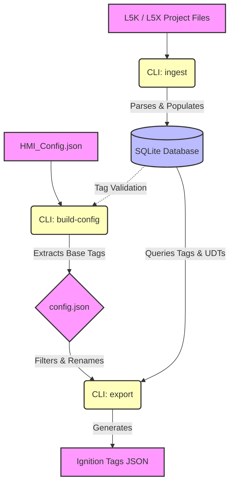

# L5K to Ignition Tag Generator

A utility for parsing Rockwell Automation L5K and L5X project files and extracting Tags, UDTs, and Add-On Instructions into an Ignition-compatible JSON structure. It utilizes a SQLite database to ingest multiple L5K/L5X files and tracks them to avoid re-ingesting duplicates.

## Features
- Fast, line-by-line state machine parser for L5K fils.
- XML parser for modern L5X files.
- Persistent SQLite database to store controllers, UDTs, and tags.
- Configurable JSON-based filtering and renaming mechanism.
- Native array handling compatible with Ignition's OPC UA arrays.
- Converts program-scoped tags into nested Ignition folders.

## Setup
Ensure you have Python 3.x installed. The tool utilizes the standard library and does not require third-party packages for core execution.

## High-Level Workflow


## Generating Configurations from HMI Tag Lists
If you have a list of tags exported from a FactoryTalk View application (or similar HMI string lists) starting with shortcuts like `[IFC1_IUS_PLC]`, you can auto-generate the exporter `config.json` file.

First, create an `hmi_config.json` file that contains the target database, the shortcut mapping, and the raw HMI tags list:
```json
{
  "database": "plc_project.db",
  "shortcut_map": {
    "PLC1": "MAIN_PLC_01",
    "AUX_PLC": "PLANT_AUX_PLC"
  },
  "hmi_tags": [
    "[PLC1]Mixer.Cycle.State",
    "[PLC1]Mixer.Tank[0].Level.Feedback.Device",
    "[AUX_PLC]Program:MainProgram.SystemState"
  ]
}
```

Then, run the `build-config` utility:
```bash
python main.py build-config hmi_config.json --output config.json
```
The utility will safely parse the JSON, deconstruct UDT paths back to their Base Tag (e.g. converting Mixer.Tank[0].Level.Feedback to just Mixer), and optionally validate that the tag exists in the SQLite database to avoid orphaned tags.

## Usage

The `main.py` script provides a CLI with subcommands to handle ingestion and export. Both subcommands look to the configuration JSON file to determine the target SQLite database path.

### General Help
```bash
python main.py help
```

### Ingestion
Ingest a single `.L5K` or `.L5X` file, or an entire directory of files into the SQLite database. The tool keeps track of ingested files, so you can safely run it against a directory multiple times without duplicating data.

```bash
# Ingest a single file
python main.py --config sample_config.json ingest "project_l5k/PLC_Rev07.L5K"

# Ingest an L5X file
python main.py --config sample_config.json ingest "project_l5x/PLC_Rev07.L5X"

# Ingest a directory of files
python main.py --config sample_config.json ingest ./project_l5k
```

### Export
Export tags from the SQLite database into a JSON file, using a configuration dictionary for whitelisting and renaming tags.

**Example `config.json`:**
```json
{
    "database": "plc_project.db",
    "tags": {
        "PT001": {"export": true, "rename": "PressureTransmitter001"},
        "Reactor_Pressure_PSI": {"export": true},
        "MainProgram.Valve_Seal_Pressure": {"export": true, "rename": "Seal_Pressure"}
    }
}
```

**Export Command:**
```bash
python main.py --config sample_config.json export --output ignition_tags.json
```

## Handling Unsupported Rockwell Data Types (AOPs)
Rockwell processors utilize internal Add-On Profiles (AOPs) and instructions (e.g., `MOTION_GROUP`, `AXIS_CIP_DRIVE`, `SELECT_ENHANCED`, `ALM`) which present themselves as UDTs in the export file. Because these cannot be natively imported into Ignition as standard tags, the tool automatically ignores them to prevent `Bad_NotFound` errors during import.

If you encounter new `Bad_NotFound` errors in Ignition for specific Rockwell types, you can add them to the blacklist:

1. Open `src/exporter/exporter.py`.
2. Locate the `IGNORED_ROCKWELL_TYPES` set at the top of the file:
   ```python
   IGNORED_ROCKWELL_TYPES = {
       'SERIAL_PORT_CONTROL', 'AXIS_CIP_DRIVE', 'MOTION_GROUP', 
       'MOTION_INSTRUCTION', 'ADD', 'DIV', 'MOV', 'ALM', 'FAL',
       'SELECT_ENHANCED'
   }
   ```
3. Add the problematic data type string (in ALL CAPS) to this list. The exporter will instantly start skipping these tags on your next run.

## Project Structure
```text
l5k_tag_generator/
├── main.py                  # Main CLI entrypoint for parsing, exporting, and building configs
├── pyproject.toml           # Project dependencies (pytest via uv)
├── README.md                # Documentation
├── src/
│   ├── cli/                 # Command-line interface logic
│   │   ├── commands.py      # Handlers for `ingest` and `export` commands
│   │   └── build_config.py  # Handler for generating standard JSON config from HMI lists
│   ├── config/              # Configuration logic
│   │   └── config.py        # Logic to parse user whitelists/renaming dictionaries
│   ├── database/            # Data persistence layer
│   │   └── db.py            # SQLite schema initialization and connection management
│   ├── exporter/            # Ignition JSON generation layer
│   │   ├── builtins.py      # Hardcoded Rockwell standard UDT definitions (e.g. TIMER, PID)
│   │   └── exporter.py      # Core logic for transforming SQLite data into Ignition JSON
│   └── parser/              # PLC Extraction layer
│       ├── l5k_parser.py    # Line-by-line state machine for legacy text-based L5K files
│       └── l5x_parser.py    # XML ElementTree parser for modern L5X files
└── tests/                   # Pytest suite
    ├── test_parser.py               # Validates database insertion mechanics
    └── test_exporter_edge_cases.py  # Validates specific Ignition tag tree construction rules
```
